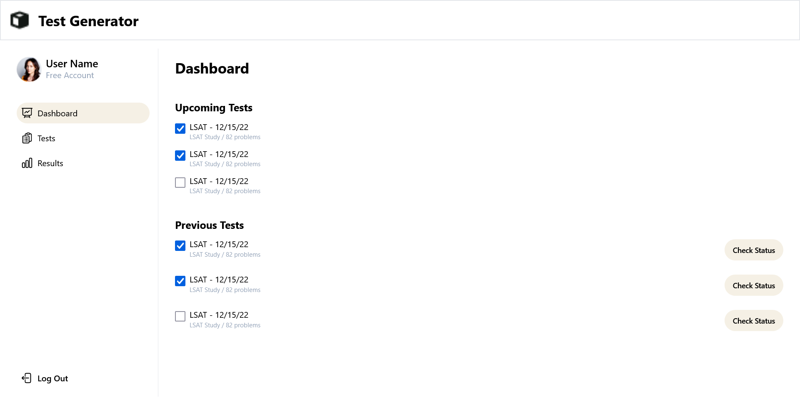
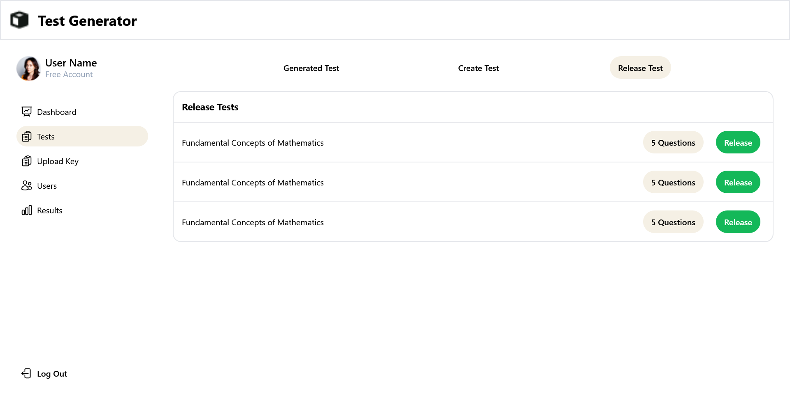

# TEST GENERATOR
You can check out the repo at this link - <a href="https://test-generator-sandy.vercel.app/"><strong>Test Generator</strong></a>
 
### USER Dashboard


### ADMIN Dashboard



### 📝 <u>DESCRIPTION</u>

This is a simple platform wherein admin can create and users give test. We have implemented several features some of them are listed below -
* Authentication - two types of accounts can be created user and admin.
* Test creation, updation, deleting, etc can be performed by the admin. Users on the other hand can give tests.
* Users can search through available tests.
* Users can check results of given tests.
* Set of questions for every user is different. We randomize the questions at the backend and then send questions to the users.

### 🛠️ <u>TECH STACK & EXTERNAL PACKAGES</u>

* #### Frontend
  * React
  * React Router Dom
  * Redux, Redux Toolkit
  * Tailwind css
  * Other Packages - Hero Icons, Html 2 Canvas, JSpdf,React - Loader - Spinner
  
* #### Backend
  * Node.js
  * Express.js
  * Mongoose
  * Other Packages - bcrypt, cors, dotenv, jsonwebtoken, nodemailer

### ⚙️ <u>INSTALLATION</u>

  * Clone this repository
    ```
    gh repo clone dnyaneshwar411/test-generator
    ```
* #### Frontend
  * Step I - move to the frontend directory of the project if not already at the location.
    ```
    cd client
    ```

  * Step II - install node modules / dependencies
    ```
    npm install
    ```

  * Step III - start the development server
    ```
    npm run dev
    ```

* #### Backend
  * Step I - move to the backend directory of the project if not already at the location.
    ```
    cd backend
    ```

  * Step II - install node modules / dependencies
    ```
    npm install
    ```
  * Step III - start the development server
    ```
    npm run server
    ```

<br/>
<br/>

### © COPYRIGHT
You are free to use this as your personal project or take it to next level, Cheers 🍻