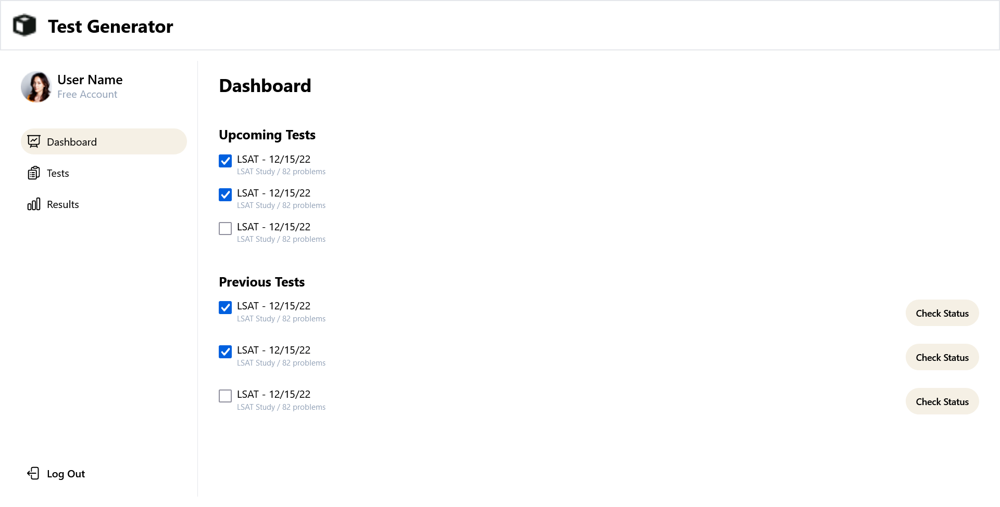
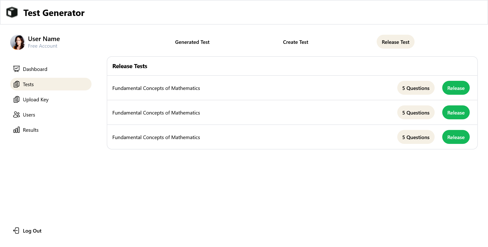

# Test Generator

### User Dashboard


### Admin Dashboard


<!-- ### Description

I have tried to replicate as much as possible to make it look exact look-alike of the original UI. Following are some of the feature that are implemented in this assessment - 
* UI is responsive
* searching by assignee name
* sorting by priority
* adding, editing, deleting tasks
* tasks cannot be deleted if it is already in completed status

### Tech Stack & External Packages
* React
* Redux
* Firebase
* Tailwind css
* Hero Icons

<br/> -->

## Installation
Step I - clone this repository
```
gh repo clone dnyaneshwar411/Test-Generator
```

Step II - move to the root directory of the project if not already at the location.

Step III - install node modules
```
npm install
```

Step IV - start the local server
```
npm run dev
```

<!-- <br/>
<br/>
You can check out the repo at this link - <a href="https://hyper-srot-assessment.vercel.app/"><strong>Hypersrot</strong></a>

<br/> -->
